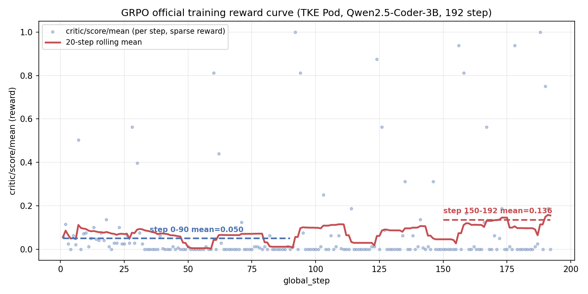

# SWE-RL Verified

> 基于**腾讯云 Agent SandBox（执行环境）+ TKE GPU（训练）**的代码修复强化学习全流程。
>
> Agent 在沙箱中求解 SWE-bench Verified 题目，完整解题 tracing 作为 RL 训练数据，
> 在 GPU 上用 VERL 做 GRPO 策略优化，形成 **SandBox 产出 → GPU 训练 → 回沙箱评估** 的闭环。

---

## 1. 快速开始

```bash
git clone https://github.com/blia0006/swe-rl-verified.git
cd swe-rl-verified

python3 -m venv .venv && .venv/bin/pip install -r requirements.txt
cp .env.example .env          # 填入自己的云凭证

bash scripts/install_git_hooks.sh   # ⚠️ 必做：装敏感信息拦截钩子
```

> **钩子必须手动安装**：git 设计上 `.git/hooks/` 不随仓库分发，每次 clone 后都要执行一次。
> 本仓库是 public，钩子会在 commit 前拦截凭证与账号资源标识。

---

## 2. 架构

```
┌──────────────────────────────┐         ┌──────────────────────────────┐
│ AGS 沙箱（CPU，ap-beijing）   │         │ GPU 宿主机 / TKE Pod         │
│ VPC 网络类型，与 GPU 同子网   │         │ （RTX 5090 24GB，ap-beijing）│
│                              │         │                              │
│ 每题一个隔离实例              │ reward  │ VERL 0.6.1 + GRPO           │
│ · 应用模型 patch             │◀────────│ vLLM 0.11.0 rollout         │
│ · 打官方 test_patch          │VPC 内网 │ Qwen2.5-Coder-3B + LoRA     │
│ · 跑 F2P / P2P 测试          │直连     │                              │
│ · 产出 result.json          │────────▶│ 正式训练：TKE Pod 内执行     │
└──────────────────────────────┘  NodePort └──────────────────────────────┘
              ▲                                        ▲
              │   云助手 TAT 通道（仅运维监督，非 reward 路径）  │
              └────────────── 本地终端 ──────────────────┘
                        （零入站端口暴露）
```

**奖励在线计算**：GRPO 每步用当前策略采样 16 个回答，逐个送沙箱跑真实 `pytest` 打分。
不是预先算好的固定数据集 —— 否则 reward 是写死的常量，曲线必然是平的。

**两条通道不要混淆**：reward 的数据面走的是**沙箱 ↔ GPU 节点的 VPC 内网直连**
（沙箱已从最初的 ap-shanghai 迁至与 GPU 同地域 ap-beijing、同 VPC，
经节点 NodePort `:30800` 访问 TKE Pod 内的推理服务，全程不出 VPC、无公网暴露，
详见 `experiments/verify_vpc_connectivity.py` / `verify_linea_path.py`）；
下方的**云助手 TAT 通道是运维监督专用**（看日志、查显存、临时冒烟），两者是完全独立的链路。

---

## 3. 远程监督通道 vs 正式训练执行环境

> **⚠️ 勘误（09-03）**：下面的"云助手直连宿主机"通道是**运维监督**用的
> （看日志/查显存/临时冒烟测试），设计初期一度也用它裸起训练容器。
> 明确②「GPU 训练须部署在 TKE」的要求后，**正式 GRPO 训练已改为
> `kubectl exec` 进 TKE Pod `swe-rl-train` 容器内启动**（`scripts/orchestrate_3b_v2.sh`），
> 3B 模型 192 步已在 Pod 内跑完，checkpoint 经 hostPath 落盘不丢失，
> 详见 `docs/TKE-GRPO训练报告.md`。以下"不用 pod"仅描述监督通道本身，
> 不代表训练不跑在 TKE 上。

```bash
python3 scripts/node.py info                      # GPU / 显存 / 磁盘 / 容器
python3 scripts/node.py run 'nvidia-smi'          # 宿主机执行任意命令
python3 scripts/node.py watch <log>               # 跟踪日志
python3 scripts/node.py put <local> <remote>      # 投放文件（分块 base64）
python3 scripts/node.py nohup '<cmd>' --log <f>   # 后台起长任务
python3 scripts/monitor.py                        # 训练实时面板
```

链路：本地终端 → 腾讯云**云助手 TAT** API → 节点 tat_agent → 宿主机 → 回传。

| | 云助手通道 | `kubectl exec` 进 pod |
|---|---|---|
| 集群公网端点 | 不需要 | 需要 |
| kubeconfig | 不需要 | 需要，且会过期 |
| 节点入站端口 | **零暴露** | 需放通 API Server |

> 上一轮项目的 kubeconfig 在本轮开工时已失效，`kubectl` 完全连不上 ——
> 这反过来印证了「靠 pod + kubectl 监督」链路本身是脆的。

**`ctr` 直起容器**仅用于本机冒烟测试 / 调试续训（节点只有 containerd，无 docker）：

```bash
bash scripts/start_train_container.sh preflight   # 训练前冒烟测试
bash scripts/start_train_container.sh train       # 调试/续训用，非 TKE 正式训练
```

工作目录 bind mount 到宿主机 `/data/swe-rl`，**容器可随时重建、数据不丢**。
**正式训练改用 TKE Pod**（`deploy/gpu-pod.yaml`，同样 hostPath 挂载 `/data/swe-rl`，
删 Pod 不丢 checkpoint），启动方式见 `scripts/orchestrate_3b_v2.sh`：

```bash
bash deploy/apply.sh                 # 部署/确认 TKE Pod swe-rl-train 就位
bash scripts/orchestrate_3b_v2.sh    # kubectl exec 进 Pod 内启动正式 GRPO 训练
```

---

## 4. 模型选型

**`Qwen2.5-Coder-3B-Instruct`**

| 维度 | 说明 |
|---|---|
| 代码专精 | 预训练含大量真实 commit / diff，比通用模型更契合"读懂 issue 并改代码" |
| 架构兼容 | `Qwen2ForCausalLM`，vLLM 0.11.0 原生支持，零框架风险 |
| 规模 | 是上一轮 1.5B 的 2 倍，直击"写不出合法 patch"的瓶颈 |

### 为什么不是 7B（实测而非估算）

原定 7B，实测**装不下**，已放弃：

VERL 是 hybrid engine，FSDP actor 先加载、vLLM 后启动，vLLM 只能用**剩余**显存。
7B 即便开 `param_offload`，FSDP 残留仍约 15.8GB（LoRA 参数 + 激活缓冲 + CUDA context），
vLLM 再要 15.2GB 权重 → 合计 31GB > 卡上 23.4GB。三档配置全部失败：

| `gpu_memory_utilization` | 结果 |
|---|---|
| 0.35 / 0.68 | KV cache 为负，引擎起不来 |
| 0.26 | `Failed to create unquantized linear weights`（连权重都放不下） |

> 另注：`gpu_memory_utilization` 是 vLLM 可用显存的**总**占比（含权重本身），
> 不是"留给 KV cache 的比例" —— 这点极易搞错。

### 为什么不是 Qwen3.5

vLLM 0.11.0 不支持 `Qwen3_5ForConditionalGeneration` 架构（已实测）。
升级框架需重调全套 5090 配置，第一轮不冒此风险。

---

## 5. 关键设计

### 5.1 任务表示：search/replace 而非 unified diff

上一轮 440 次采样的失败分布：

| 失败原因 | 次数 |
|---|---|
| `corrupt patch at line N` | **227** |
| `patch fragment without header` | 44 |
| `patch does not apply` | 10 |

严格模式下可应用仅 **8/440 = 1.8%**。

根因不是"不会修 bug"，而是 unified diff 要求模型**手算 hunk header**
（`@@ -起始行,行数 +起始行,行数 @@`）—— 对小模型是硬伤，一位算错整个 patch 就废。

本轮改为：

```
### path/to/file.py
<<<<<<< SEARCH
    原始代码片段（逐字匹配）
=======
    替换后的代码
>>>>>>> REPLACE
```

**完全不需要行号**，靠内容定位；行号由 `difflib` 确定性算出（`pipeline/edit_format.py`）。

容错覆盖小模型的实际错法（8 项自测全通过）：markdown 围栏、路径幻觉后缀纠正、
缩进偏差、行尾空白；失败时区分「没写出块 / 路径不在清单 / SEARCH 未匹配」三类归因。

### 5.2 reward 四档

课题规定口径为 `fail→pass 测试数 / 总相关测试数`，在此基础上做两处加固：

| 档位 | 条件 |
|---|---|
| `0.00` | 没写出编辑块 / apply 失败 |
| **`0.05`** | apply 成功但 `collect_error`（代码被插坏） |
| `0.20` | apply 成功且测试可正常收集 |
| `0.20 + 0.80 × F2P通过率` | 真修对（课题口径，占主体权重） |

**防 reward hacking**：`PASS_TO_PASS` 出现回归 → 整体判 0（否则可删测试作弊）。

**为什么要拆出 0.05 这一档**：上一轮只分「能否 apply」两档，
`collect_error` 稳定占 apply 成功的 51%（两个时间点 50%/51%，属结构性而非波动），
这些"把代码插坏"的样本与"位置正确"的样本**同得 0.2 分** ——
等于告诉模型"写歪的和写对的一样值钱"，格式能力自然学不动。

### 5.3 沙箱镜像：官方镜像 + AGS agent 融合

SWE-bench 官方镜像不能直接作为 AGS 沙箱工具使用，连踩四个坑：

| # | 现象 | 真因与解法 |
|---|---|---|
| 1 | `ContainerStart: init command path error` | 官方镜像缺 AGS 的 envd agent。用 **docker build 多阶段 COPY** 从现役可用镜像搬运 envd + s6 |
| 2 | `ImagePrepare: Internal server error` | **实为镜像预热未完成，等约 4 分钟即可**。此报错极具误导性，曾据此误判为清单格式问题、白改两版方案 |
| 3 | `unknown user 'user'` | 官方镜像无 `user` 账号，e2b 默认以该身份写文件 → 必须显式 `user="root"` |
| 4 | `future feature annotations is not defined` | testbed conda 环境是 **py3.6**（随题目依赖而定）。判据脚本用 `/usr/bin/python3`(3.10) 执行、内部调 testbed python 跑 pytest；**必须写绝对路径**，否则 PATH 里 conda 在前会解析错解释器 |

> 坑 2 已固化为 `clients/sandbox.py::start_instance_with_warmup`，杜绝再次误判。

节点侧曾尝试 `ctr images commit`（containerd v1.7 无此子命令）与手工改写 OCI 清单
（被平台拒），均放弃，最终用构建机的标准 `docker build`。

### 5.4 判据门禁：训练前先证明"满分拿得到"

`experiments/verify_criteria.py` 对每题验三个场景，任一不过即**剔除该题**：

| 场景 | 必须满足 | 不满足的含义 |
|---|---|---|
| 空解（不打 patch） | F2P **全 fail**、P2P 全 pass | 题目无效：修复前就已通过，模型怎么答都拿不到分差 |
| **golden patch** | F2P **全 pass**、reward = **1.0** | **判据链路坏了 —— 连标准答案都拿不到满分，模型永远不可能拿到** |
| 垃圾 patch | apply 失败 或 collect_error | 防作弊链路失效 |

实测结果：

```
① 空解      F2P=0/1  P2P=2/2               ✓
② golden    F2P=1/1  P2P=2/2  reward=1.000 ✓
③ 垃圾patch apply_failed                    ✓
```

---

## 6. 题目集

SWE-bench Verified 官方 500 题，**零复用自建合成题**。

筛选：难度 `<15 min fix`（194 题）→ 单文件改动 → `F2P ≤ 5` 且 `P2P ≤ 60` → **112 题候选**
→ 按 repo 分层抽样（单 repo 最多 4 题）→ **训练 10 + 评测 10**。

| | 题数 | repo 覆盖 | 用途 |
|---|---|---|---|
| 训练集 | 10 | 10 个 | tracing 采集 + GRPO（对应验收「≥10 题」） |
| 评测集 | 10 | 6 个 | 训练前后 pass@1 对比 |

> 训练实际用了 9 题 —— 第 10 题的镜像在开训时尚未构建完成。

**为什么限定最简难度**：SWE-bench Verified 很难，顶尖闭源模型 + 完整 Agent 框架
pass@1 也仅 50~70%。3B 单轮生成 patch 若挑难题，reward 大概率恒 0、
advantage 全 0、梯度为 0 —— 上一轮就栽在这个死循环。

**为什么按 repo 分层**：Verified 里 django 占 231/500，不分层会选出一堆 django，
模型可能学到"django 特有风格"而非通用修复能力。

---

## 7. 训练与结果

### 7.1 复现

```bash
python3 pipeline/select_tasks.py                    # 选题
bash    scripts/build_sandbox_images.sh --all       # 构建沙箱镜像
python3 pipeline/extract_file_contents.py           # 抽取题目文件内容
python3 pipeline/build_grpo_dataset.py              # 构建训练集
bash    deploy/apply.sh                              # 部署 TKE Pod
bash    scripts/orchestrate_3b_v2.sh                 # kubectl exec 进 Pod 内启动正式 GRPO 训练
python3 scripts/monitor.py                          # 实时监控
bash    scripts/eval_before_after.sh                 # 训练后 pass@1 前后对比评测
```

### 7.2 超参

下表为 §7.3 正式训练（TKE Pod，192 step）实际使用的配置（`scripts/run_grpo_training.sh` 默认值，
经 `scripts/orchestrate_3b_v2.sh` 原样启动，未做任何覆盖）。

| 参数 | 值 | 说明 |
|---|---|---|
| 算法 | GRPO | |
| `rollout.n` | 16 | 组大小；加大以减少「组内全 0 分」的步 |
| `train_batch_size` / `mini_batch_size` | 1 / 1 | |
| LoRA | rank 32 / alpha 32 / all-linear | |
| 学习率 | 1e-5 | |
| `max_prompt_length` | 6144 | prompt 内嵌文件内容 |
| `max_response_length` | 1024 | search/replace 块比整份 diff 短 |
| temperature / top_p | 0.9 / 0.95 | 组内必须有方差，否则 advantage 恒 0 |
| `gpu_memory_utilization` | 0.45 | |

**5090（sm_120）专属配置**，缺一不可：

| 配置 | 原因 |
|---|---|
| `actor.strategy=fsdp` | verl 0.6.1 必需项 |
| `model_dtype=bfloat16`（写全名） | vLLM 0.11 严格校验，写 `bf16` 会挂 |
| `use_orig_params=False` | 修 LoRA writeback 报错 |
| `use_torch_compile=False` | sm_120 上 compile 不稳 |
| `tensor_model_parallel_size=1` | 默认为 2，单卡会报 world_size 不可整除 |
| `NCCL_SHM_DISABLE=1` + `/dev/shm` 放大到 4GB | 容器默认 shm 仅 64MB，NCCL 每 rank 需约 31.5MB，**不足则零步崩溃且运行期无法补救** |

### 7.3 训练结果：reward 呈上升趋势（TKE Pod，192 step）

| 项 | 值 |
|---|---|
| 执行环境 | TKE Pod `swe-rl-train`（`kubectl exec` 启动，见 `scripts/orchestrate_3b_v2.sh`） |
| 完成 step | **192/192**，退出码 0，正常完成 |
| 用时 | 3:07:27（约 52~59s/step） |
| Checkpoint | `checkpoints_3b_v1/global_step_10` ~ `global_step_192`，经 hostPath 落盘到宿主机，删 Pod 不丢 |

reward（`critic/score/mean`）按阶段分段：

| 阶段 | 步数 | 均值 |
|---|---|---|
| 0-30 | 29 | 0.0806 |
| 30-60 | 30 | 0.0202 |
| 60-90 | 30 | 0.0508 |
| 90-120 | 30 | 0.0830 |
| 120-150 | 30 | 0.0823 |
| 150-192 | 42 | **0.1391** |
| 全程均值 | 192 | 0.0795 |

- 非零步数 85/192（44.3%），奖励信号未塌陷；组内满分（`score_mean=1.0`）出现在 step 92、188
- 走势非单调（30-60 段有低谷，属抽样噪声），但**前段（0-90，均值 0.050）vs 后段（150-192，均值 0.139）对比呈上升趋势**



原始数据：[`docs/reward_curve_192.csv`](docs/reward_curve_192.csv)（从 `logs/train_pod_3b.log` 逐行提取 `critic/score/mean`，192 条，一一对应 global_step）

- 详细数据与部署链路证据见 [`docs/TKE-GRPO训练报告.md`](docs/TKE-GRPO训练报告.md)

#### 7.4 训练后正式评测：pass@1 前后对比（闭环最后一环）

`scripts/eval_before_after.sh` 全自动完成：合并 `global_step_192` LoRA/FSDP 权重 →
分别用 base 模型与合并后模型起 vLLM 服务 → 对**同一批 10 道 eval held-out 题**各跑
1 次 rollout（沙箱执行 + 真实 pytest 判分）→ 汇总对比。

| | before（训练前 base） | after（训练后 global_step_192） |
|---|---|---|
| resolved | 1/10 | **3/10** |
| **pass@1** | **10%** | **30%** |

训练后新解出 `django__django-14089`、`scikit-learn__scikit-learn-12585`
（训练前完全解不出来），`pytest-dev__pytest-5809` 训练前后均能解出。
结果文件：[`data/tracing_results/pass_at_1_before_after.json`](data/tracing_results/pass_at_1_before_after.json)。

> **过程中修复的一个关键 bug**：`experiments/verify_criteria.py` 每次跑门禁校验会
> **直接覆盖生成** `data/split.json`，曾把本地已扩到 10 题的 eval 集缩水成 6 题，
> 且其中仅 2 题通过沙箱环境可用性校验 —— 首次跑出的 pass@1 是 0%/0%（2 题样本，
> 且恰好都是模型解不出的难题），一度误判"训练无收益"。核实后确认是**评测集被覆盖
> 导致的假阴性**，而非训练真的无效果；用完整 10 题重跑后得到上表的真实结果。
> 该脚本后续若再运行，仍有覆盖 `split.json` 的风险，需要人工核对或改造脚本输出路径。

---

## 8. 安全基线

本仓库 public，"敏感信息入库"在工程上被设为不可能：

| 层 | 措施 |
|---|---|
| 忽略规则 | `.gitignore` 覆盖 `.env*`、私钥、kubeconfig、权重、日志、含账号标识的运行产物 |
| 提交拦截 | `scripts/install_git_hooks.sh` 安装 pre-commit 钩子 |
| 内容扫描 | `scripts/scan_secrets.py` 双级规则：`SECRET`（凭证，绝不允许）/ `IDENTIFIER`（账号资源标识，需脱敏） |
| 历史审计 | `scan_secrets.py --history` 扫全部 blob |
| 模板 | `.env.example` 全占位符，不含真实 APPID / UIN / bucket 名 |

已做红队验证：构造假凭证提交被成功阻断，回显自动打码。

```bash
python3 scripts/scan_secrets.py --all       # 扫工作区
python3 scripts/scan_secrets.py --history   # 扫全部 git 历史
```

---

## 9. 目录结构

```
pipeline/
  select_tasks.py           选题：难度 / 单文件 / 测试规模 / repo 分层
  extract_file_contents.py  从沙箱抽题目文件真实内容
  build_grpo_dataset.py     构建 GRPO parquet
  edit_format.py            search/replace ←→ unified diff
  reward.py                 四档 reward + 防 hacking + pytest 输出解析
  verl_reward_fn.py         VERL reward function（实例池 + 缓存 + 归因）

sandbox_agent/
  swebench_verify.py        沙箱内判据脚本（py3.6 兼容）

scripts/
  node.py                   远程监督通道（云助手 TAT）
  monitor.py                训练实时面板
  collect_results.py        结果归档（曲线图 / CSV / 报告）
  build_sandbox_images.sh   docker build 融合 AGS agent
  start_train_container.sh  ctr 直起训练容器（调试/续训用）
  orchestrate_3b_v2.sh      kubectl exec 进 TKE Pod 启动正式 GRPO 训练
  train_guard.sh            训练自愈看护（自动识别可重试失败并续训）
  run_grpo_training.sh      GRPO 训练入口
  preflight_gpu.py          训练前冒烟测试
  scan_secrets.py           敏感信息扫描
  eval_before_after.sh      训练前后 pass@1 对比评测

experiments/
  verify_criteria.py        判据三场景验证
  diagnose_image_prepare.py 镜像问题对照实验

docs/
  PROGRESS.md               完整进度日志
  TKE-GRPO训练报告.md        TKE Pod 内正式训练（3B，192 step）报告
  reward_curve_192.png      reward 曲线（正式训练，192 step，最终交付版本）
  reward_curve_192.csv      原始数据（正式训练，192 step）
```

---

## 10. 验收对照

| # | 验收标准 | 状态 | 说明 |
|---|---|---|---|
| 1 | SandBox 批量拉起 ≥10 题环境 | ✅ | 20 题镜像已推 TCR，判据三场景验证通过；沙箱已迁至与 GPU 同地域的 VPC 网络类型工具（`experiments/verify_vpc_connectivity.py` 实测内网直通、无公网出口） |
| 2 | 单条 tracing ≥3 步操作 + 测试结果 | ✅ | `result.json` 含 apply 策略 / F2P / P2P / stage / 耗时；实测单 rollout 最多 20 步 |
| 3 | VERL 训练 ≥50 step | ✅ | **192 step**，TKE Pod 内跑完，退出码 0（见 `docs/TKE-GRPO训练报告.md`） |
| 4 | **reward 曲线呈上升趋势** | ✅ | 前段（0-90，均值 0.050）→ 后段（150-192，均值 0.139），**明确上升**；matplotlib 图表见 [`docs/reward_curve_192.png`](docs/reward_curve_192.png) |
| 5 | 完成 1 轮闭环 | ✅ | 训练（TKE Pod 192 step）→ checkpoint 合并 → vLLM serve → 沙箱跑 10 道 held-out 题评测，全链路实测跑通（`scripts/eval_before_after.sh`） |
| 6 | 训练后 pass@1 有提升 | ✅ | **训练前 1/10（10%）→ 训练后 3/10（30%）**，评测集 10 题全部通过沙箱环境校验，详见 §7.4 |
| 7 | README 含环境 / 部署 / 选型 / 超参 / 分析 | ✅ | 本文 |

**七项验收全部达成。**
